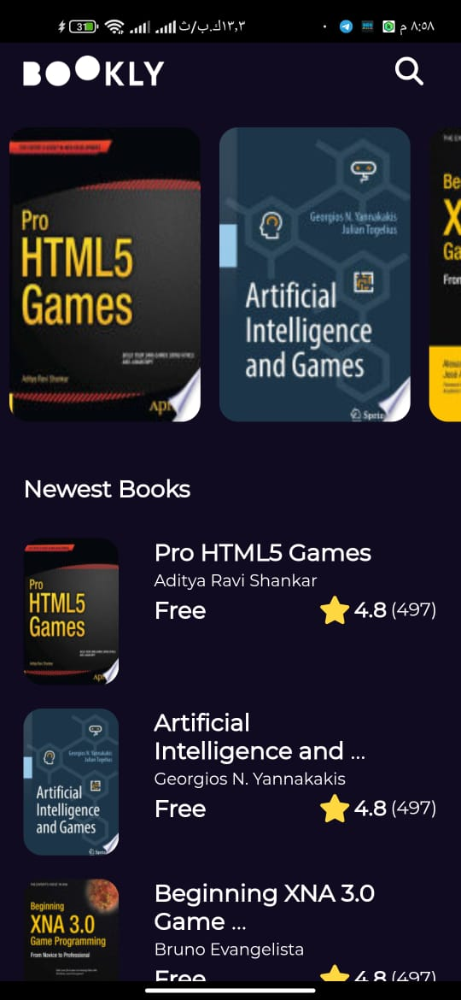
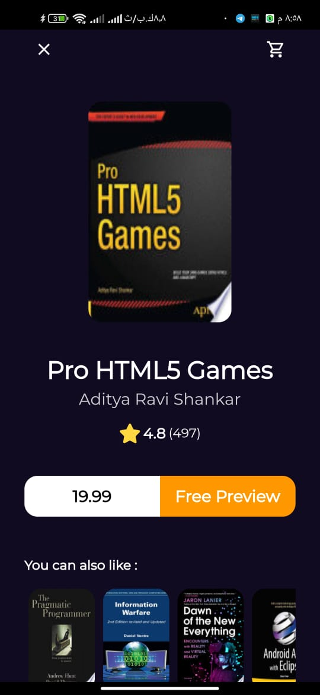

# Bookly App 

Flutter App for Display programming books using google books API.

## Features

- Animated Splash Screen
- You can Search for the book you want
- Architecture Pattern : MVVM

## Screenshots

